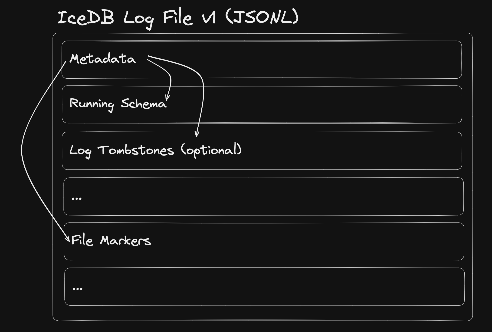

# IceDB v3 Architecture

<!-- TOC -->

* [IceDB v3 Architecture](#icedb-v3-architecture)
    * [Log file(s)](#log-files)
        * [Log file structure](#log-file-structure)
            * [Metadata](#metadata)
            * [Schema (sch)](#schema-sch)
            * [Log file tombstones (tmb)](#log-file-tombstones-tmb)
            * [File marker (f)](#file-marker-f)
        * [Reading the log files](#reading-the-log-files)
    * [Merging](#merging)
    * [Tombstone cleanup](#tombstone-cleanup)
    * [Concurrent Merge and Tombstone cleanup](#concurrent-merge-and-tombstone-cleanup)

<!-- TOC -->

## Log file(s)

IceDB keeps track of the active files and schema in a log, much like other database systems. This log is stored in S3,
and is append-only. This log can also be truncated via a tombstone cleanup process described below.

Both the schema and active files are tracked within the same log file, and in each log file.

### Log file structure



#### Metadata

The log file is new-line delimited JSON, with the line being special. The first line is in the schema (typescript
format):

```ts
interface {
  v: string // the version number
  t: number // unix ms timestamp of file creation. For merges, this is the timestamp after listing ends and merging logic begins, for append operations, it's the moment metadata is created, tombstone cleanup leaves the current value when replacing a file
  sch: number // line number that the accumulated schema begins at
  f?: number // line number that the list of file markers begins at
  tmb?: number // line number that the list of log file tombstones start at
}
```

#### Schema (sch)

There is only one schema line per file, taking the form:

```ts
interface {
  [column: string]: string // example: "user_id": "VARCHAR"
}
```

Columns are never removed from the schema, and they always consist of the union of log file schemas.

If data type conflicts are found (e.g. log file A has a column as a VARCHAR, but log file B has a column as a BIGINT),
then the merge fails and error logs are thrown. This can be mitigated by having the ingestion instances read the schema
periodically and caching in memory (only need to read log files up through the last schema line, then can abort
request). One could also choose to use a transactionally-secure schema catalog to protect this, have data sources
declare their schema ahead of time, and more to validate the schema. Ultimately it is not up to IceDB to verify the
schema during inserts.

All columns should be considered nullable, however it is up to the developer to determine whether there can be defaults for partition and sorting columns (otherwise they should be logically required in your code)

#### Log file tombstones (tmb)

These are the logs files that were merged into a new file, and only exists if this log file was the result of a merge.
If log files A and B were merged into C, not all data part files listed in A and B were necessarily merged into new data
parts marked in C. Because of this, files that existed in A and B that were not part of the merge are copied to log file
C in the alive status. Any files that were merged are marked as not alive by having a tombstone reference.

Because log files A and B were merged into C, we created "tombstones" for log files A and B. Tombstones are kept track
of so that some background cleaning process can remove the merged log files after some grace period (for example files
older than the max query timeout * 2). This is why it's important to insert infrequently and in large batches.

They take the format:

```ts
interface {
  "p": string // the file path, e.g. /some/prefixed/_log/ksuid.jsonl
  "t": number // the timestamp when the tombstone was created (when this log file was first part of a merge)
}
```

#### File marker (f)

There are at least one file markers per log file, taking the form:

```ts
interface {
  "p": string // the file path, e.g. /some/prefixed/file.parquet
  "b": number // the size in bytes
  "t": number // created timestamp in milliseconds
  "tmb"?: int // exists if the file is not alive, the unix ms the file was tombstoned
}
```

Tombstone markers only exists on the file marker if this file has been marked not alive, which only occurs as the 
result of a merge.

### Reading the log files

To get a snapshot-consistent view of the database, a reader must perform the following actions:

1. List all files in the `_log` prefix for the table
2. Read each found log file sequentially (they are sorted by time), removing known data parts as file markers are found
   with tombstone references, and accumulating the current schema (handling schema conflicts if found)
3. Return the final list of active files and accumulated schema (Note: The `log` package returns all files, and you 
   can filter for those that do not have a `.Tombstone is None`)

A stable timestamp can be optionally used to "time travel" *(this should not be older than the `tmb_grace_sec` to
prevent missing data)*. This can be used for repeatable reads of the same view of the data.

## Merging

Merging requires coordination with an exclusive lock on a table.

When a merge occurs, both data parts and log files are merged. A newly created log file is the combination of:

1. New data parts created in the merge (should be 1) (`f`)
2. Files that were part of the merge, marked with tombstone references (`f`)
3. Files that were not part of the merge, marked alive (`f`)
4. Tombstones of the logs files involved in the merge (`tmb`)

The reason for copying the state of untouched files is that the new log file represents a new view of modified data.
If log files A and B were merged into C, then A and B represent a stale version of the data and only exist to prevent
breaking existing list query operations from not being able to find their files.

Merged log files are not immediately deleted to prevent issues with current operations, and are marked as merged in the
new log file so they are able to be cleaned up. You must to ensure that files are only cleaned long after they could be
in use (say multiple times the max e2e query timeout, including list operation times). This is why it's important to
insert infrequently and in large batches, to prevent too many files from building up before they can be deleted.

Data part files that were part of the data merge are marked with tombstones so in the event that a list operation sees
files A, B, and C, it knows that the old files were merged and should be removed from the resulting list of active
files. If it only ends up seeing A and B, then it just gets a stale view of the data. This is why it's important to
ensure that a single query gets a constant-time view of the database, so nested queries do not cause an inconsistent
view of the data.

Tombstones include the timestamp when they were first merged for the tombstone cleanup worker. When files merge, the
must always carry forward any found tombstones. Tombstone cleanup is idempotent so in the event that a merge occurs
concurrently with tombstone cleanup there is no risk of data loss or duplication. Merging must also always carry forward
file markers that have tombstones, as these are also removed by the tomestone cleanup process.

## Tombstone cleanup

The second level of coordination with a second exclusive lock that is needed is tombstone cleaning. There is a
separate `tmb_grace_sec` parameter that controls how long tombstone files are kept for.

When tombstone cleanup occurs, the entire state of the log is read. Any tombstones that are found older than
the `tmb_grace_sec` are deleted from S3.

When the cleaning process finds a log file with tombstones, it first deletes those files from S3. If that is
successful (not found errors being idempotent passes), then the log file is replaced with the same contents, minus the
tombstones and any file markers that had those tombstone references.

## Concurrent Merge and Tombstone cleanup

If you have multiple hosts running merge and tombstone cleanup, then you will need to coordinate them with a system
like etcd, Zookeeper, Postgres, CockroachDB, or anything that provide serializable transactions or native exclusive
locking.

Tombstone cleanup would simply result in redundant actions which can reduce performance, however concurrent merges
on the same parts may result in duplicate data, which must be avoided.
