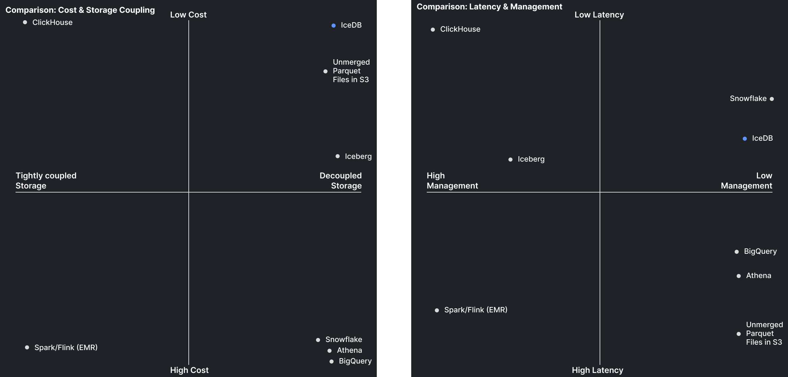

# IceDB

IceDB is an in-process Parquet merge engine for better data warehousing in S3, using only S3, with MVCC, time travel queries, and atomic operations.

No Spark, no JVM, no data warehouse experience required.

IceDB runs stateless, and stores data in easily readable formats to allow any language or framework to parse 
the log (jsonl) and read the data (parquet), making it far easier to insert, migrate, query, run, and scale than alternatives.

It's queryable by anything that understands parquet, and runs 54x 
cheaper than managed solutions such as BigQuery, Snowflake, and Athena.

IceDB tracks table schemas as standard SQL types, supports dynamic schema evolution, and divides your data into tables 
and partitions.

IceDB merges parquet files and manages tombstone cleanup to optimize your data storage for faster queries, very similar 
to what systems like ClickHouse do under the hood. Except IceDB does it effectively stateless: All state and storage 
is in S3. This makes it extremely easy to run and scale. When you need to introduce concurrent mutations at the 
table level, you can introduce coordination through exclusive locks. The IceDB log format also uses the 
widely understood newline-delimited JSON format, making it trivial to read from any language.

It retains many of the features of modern OLAP systems (such as ClickHouse’s Materialized Views), adds some new ones,
and makes it way easier to build scalable data systems with a focus on true multi-tenancy.

IceDB can replace systems like BigQuery, Athena, and Snowflake, but with
clever data design can also replace provisioned solutions such as a ClickHouse cluster, Redshift, and more.

Query engines such as DuckDB, ClickHouse, CHDB, Datafusion, Pandas, or custom parquet readers in any language can 
easily read IceDB data in hundreds of milliseconds, and even faster when combined with the [IceDB S3 Proxy](https://github.com/danthegoodman1/IceDBS3Proxy) for transparent queries (the client just thinks it's S3) like with 
the ClickHouse S3 function `s3('https://icedb-s3-proxy/**/*.parquet')` or DuckDB's
`read_parquet('s3://icedb-s3-proxy/**/*.parquet')`.

<!-- TOC -->
* [IceDB](#icedb)
  * [Quick Start](#quick-start)
  * [How does IceDB work?](#how-does-icedb-work)
  * [Examples](#examples)
  * [Performance test](#performance-test)
  * [Comparisons to other systems](#comparisons-to-other-systems)
    * [Why IceDB?](#why-icedb)
    * [Why not BigQuery or Athena?](#why-not-bigquery-or-athena)
    * [Why not ClickHouse, TimescaleDB, RedShift, etc.?](#why-not-clickhouse-timescaledb-redshift-etc)
    * [Why not the Spark/Flink/EMR ecosystem](#why-not-the-sparkflinkemr-ecosystem)
    * [Why not Iceberg?](#why-not-iceberg)
    * [When not to use IceDB](#when-not-to-use-icedb)
  * [Tips before you dive in](#tips-before-you-dive-in)
    * [Forcing property types](#forcing-property-types)
    * [Insert in large batches](#insert-in-large-batches)
    * [Merge and Tombstone clean often](#merge-and-tombstone-clean-often)
    * [Large partitions, sort your data well!](#large-partitions-sort-your-data-well)
    * [Schema validation before insert](#schema-validation-before-insert)
    * [Tracking the running schema](#tracking-the-running-schema)
    * [Separation of log and data](#separation-of-log-and-data)
  * [Usage](#usage)
    * [Partition function (`part_func`)](#partition-function-part_func)
    * [Sorting Order (`sort_order`)](#sorting-order-sort_order)
    * [Removing partitions (`remove_partitions`)](#removing-partitions-remove_partitions)
    * [Rewriting partitions (`rewrite_partition`)](#rewriting-partitions-rewrite_partition)
    * [Time-travel queries](#time-travel-queries)
  * [Pre-installing DuckDB extensions](#pre-installing-duckdb-extensions)
  * [Merging](#merging)
  * [Concurrent merges](#concurrent-merges)
  * [Tombstone cleanup](#tombstone-cleanup)
  * [Custom Merge Query (ADVANCED USAGE)](#custom-merge-query-advanced-usage)
    * ["Seeding" rows for aggregations](#seeding-rows-for-aggregations)
  * [Custom Insert Query (ADVANCED USAGE)](#custom-insert-query-advanced-usage)
      * [De-duplicating Data on Merge](#de-duplicating-data-on-merge)
      * [Replacing Data on Merge](#replacing-data-on-merge)
      * [Aggregating Data on Merge](#aggregating-data-on-merge)
<!-- TOC -->

## Quick Start

Clone the repo:

```
git clone https://github.com/danthegoodman1/icedb
docker compose up -d # starts local minio server
pip install git+https://github.com/danthegoodman1/icedb duckdb
```

_Use pip3 if you are on macOS or have a dual installation_

```py
import duckdb
from icedb.log import S3Client, IceLogIO
from icedb import IceDBv3, CompressionCodec
from datetime import datetime
from time import time

# S3 configuration dictionary
S3_CONFIG = {
    "s3_region": "us-east-1",
    "s3_endpoint": "http://localhost:9000",
    "s3_access_key_id": "user",
    "s3_secret_access_key": "password",
    "s3_use_ssl": False,
    "s3_url_style": "path"  # can be 'path' or 'vhost'
}

S3_BUCKET_CONFIG = {
    "bucket": "testbucket",
    "prefix": "example",
}

# create an s3 client to talk to minio
s3c = S3Client(
    s3prefix=S3_BUCKET_CONFIG["prefix"],
    s3bucket=S3_BUCKET_CONFIG["bucket"],
    s3region=S3_CONFIG["s3_region"],
    s3endpoint=S3_CONFIG["s3_endpoint"],
    s3accesskey=S3_CONFIG["s3_access_key_id"],
    s3secretkey=S3_CONFIG["s3_secret_access_key"]
)

example_events = [
    {
        "ts": 1686176939445,
        "event": "page_load",
        "user_id": "user_a",
        "properties": {
            "page_name": "Home"
        }
    }, {
        "ts": 1676126229999,
        "event": "page_load",
        "user_id": "user_b",
        "properties": {
            "page_name": "Home"
        }
    }, {
        "ts": 1686176939666,
        "event": "page_load",
        "user_id": "user_a",
        "properties": {
            "page_name": "Settings"
        }
    }, {
        "ts": 1686176941445,
        "event": "page_load",
        "user_id": "user_a",
        "properties": {
            "page_name": "Home"
        }
    }
]


def part_func(row: dict) -> str:
    """
    Partition by user_id, date
    """
    row_time = datetime.utcfromtimestamp(row['ts'] / 1000)
    part = f"u={row['user_id']}/d={row_time.strftime('%Y-%m-%d')}"
    return part


# Initialize the client
ice = IceDBv3(
    part_func,
    ['event', 'ts'],
    S3_CONFIG["s3_region"],
    S3_CONFIG["s3_access_key_id"],
    S3_CONFIG["s3_secret_access_key"],
    S3_CONFIG["s3_endpoint"],
    s3c,
    "dan-mbp",
    s3_use_path=S3_CONFIG["s3_url_style"] == "path", # path is needed for local minio
    compression_codec=CompressionCodec.ZSTD
)

# Insert records
inserted = ice.insert(example_events)
print('inserted', inserted)

# Read the log state
log = IceLogIO("demo-host")
_, file_markers, _, _ = log.read_at_max_time(s3c, round(time() * 1000))
alive_files = list(filter(lambda x: x.tombstone is None, file_markers))

# Setup duckdb for querying local minio
ddb = duckdb.connect(":memory:")
ddb.execute("install httpfs")
ddb.execute("load httpfs")

# Set DuckDB S3 configuration from the config dictionary
for key, value in S3_CONFIG.items():
    if key == "s3_endpoint":
        # Strip protocol prefix by splitting on :// once
        value = value.split("://", 1)[1]
    ddb.execute(f"SET {key}='{value}'")

# Query alive files
query = ("select user_id, count(*), (properties::JSON)->>'page_name' as page "
         "from read_parquet([{}]) "
         "group by user_id, page "
         "order by count(*) desc").format(
    ', '.join(list(map(lambda x: "'s3://" + ice.data_s3c.s3bucket + "/" + x.path + "'", alive_files)))
)
print(ddb.sql(query))
```

```
inserted [{"p": "example/_data/u=user_a/d=2023-06-07/c2bc1eef-b2cd-404a-9ec6-097e27d3130f.parquet", "b": 693, "t": 1702822195892}, {"p": "example/_data/u=user_b/d=2023-02-11/2d8cb9b1-450f-455f-84e0-527b8fb35d5f.parquet", "b": 585, "t": 1702822195894}]
┌─────────┬──────────────┬──────────┐
│ user_id │ count_star() │   page   │
│ varchar │    int64     │ varchar  │
├─────────┼──────────────┼──────────┤
│ user_a  │            2 │ Home     │
│ user_a  │            1 │ Settings │
│ user_b  │            1 │ Home     │
└─────────┴──────────────┴──────────┘
```

For more in-depth examples, see the [Examples](#examples) section

## How does IceDB work?

Inserts, merges, and tombstone cleanup are powered by Python and DuckDB.
IceDB runs stateless with a log in S3, meaning that you only pay for storage and compute during operations, enabling
true serverless analytical processing. It does
so in an open and easily readable format to allow for any language or framework to parse the icedb log (jsonl) and read
the data (parquet).

The IceDB log keeps track of alive data files, as well as the running schema which is updated via insertion. Query
engines such as DuckDB, ClickHouse, CHDB, Datafusion, Pandas, or custom parquet readers in any
language can easily read IceDB data in hundreds milliseconds,
especially when combined with the [IceDB S3 Proxy](https://github.com/danthegoodman1/IceDBS3Proxy).

See more in [ARCHITECTURE.md](ARCHITECTURE.md)

## Examples

See the [examples/](examples) directory for many examples like Materialized Views, custom merge queries, schema
validation before insert, and more.

- [Simple example](examples/simple-full.py)
- [Materialized View example](examples/materialized-view.py)
- Custom merge queries [aggregation](examples/custom-merge-aggregation.py)
  and [replacing](examples/custom-merge-replacing.py)
- [Verify schema before insert](examples/verify-schema.py)
- API using [flask](examples/api-flask.py) and [falcon](examples/api-falcon.py)
- [Segment webhook sink](examples/segment-webhook-sink.py)

## Performance test

IceDB can easily insert hundreds of thousands of rows per second per instance, and query engines can query upwards of 
hundreds of millions of rows per second.

Performance depends on a variety of things such as query engine, network/disk, and how efficiently 
your data is merged at query time. Query performance depends on how efficiently the query engine can read Parquet.
I've reached >100M rows/s with ClickHouse using IceDB.

Running multiple single-threaded insert web servers will be more performant than a single multithreaded web server due to the overhead of multithreading in python web servers, as seen in the performance test differences between the local test (2M/sec on small sample rows) vs the chicago dataset (40-50k/sec with 100k batch, 80-90k/sec with 1M batch).

See [perf_tests](perf_tests) for examples.

## Comparisons to other systems

IceDB was made to fill the gap between solutions like ClickHouse and BigQuery, solving a stronger balance between
decoupled storage (data and metadata) and compute, easily self-hosted, open source, easily extensible and flexible,  
multi-tentant, and ready for massive scale.


_To be transparent, I’ve omitted systems I’ve never used before (such as databricks), and do not have extensive 
experience with some 
(such as Snowflake)._

### Why IceDB?

IceDB offers many novel features out of the box that comparable data warehouses and OLAP DBs don't:

- Native multi-tenancy with prefix control and the [IceDB S3 Proxy](https://github.com/danthegoodman1/IceDBS3Proxy),
  including letting end-users write their own SQL queries
- True separation of data storage, metadata storage, and compute with shared storage (S3)
- Zero-copy data sharing by permitting access to S3 prefixes for other users
- Multiple options for query processing (DuckDB, ClickHouse, CHDB, Datafusion, Pandas, custom parquet readers in any
  language)
- Open data formats for both the log and data storage
- Extreme flexibility in functionality due to being in-process and easily manipulated for features like materialized
  views, AggregatingMergeTree and ReplacingMergeTree-like functionality

### Why not BigQuery or Athena?

BigQuery offers a great model of only paying for S3-price storage when not querying, and being able to summon
massive resources to fulfill queries when requested. The issues with BigQuery (and similar like Athena) is that:

- They are egregiously expensive at $5/TB processed
- Charge on uncompressed data storage (and they reserve compressed billing for their largest customers)
- They are limited to their respective cloud providers
- Closed source, no way to self-host or contribute
- Only one available query engine
- Show query startup time

For example, queries on data that might cost $6 on BigQuery would only be around ~$0.10 running IceDB and
dynamically provisioning a CLickHouse cluster on fly.io to respond to queries. That's a cost reduction of 60x
without sacrificing performance.

While IceDB does require that you manage some logic like merging and tombstone cleaning yourself, the savings,
flexibility, and performance far outweigh the small management overhead.

To get the best performance in this model, combine with the
[IceDB S3 Proxy](https://github.com/danthegoodman1/IceDBS3Proxy)

### Why not ClickHouse, TimescaleDB, RedShift, etc.?

We love ClickHouse, in fact it's our go-to query engine for IceDB in the form of
[BigHouse](https://github.com/danthegoodman1/bighouse) (dynamically provisioned ClickHouse clusters)

The issue with these solutions are the tight coupling between storage, metadata, and compute. The lack of elasticity
in these systems require that
have the resources to answer massive queries idle and ready, while also requiring massive resources for inserting
when large queries are only occasional (but need to be answered quickly).

IceDB allows for ingestion, merging, tombstone cleaning, and querying all in a serverless model due to compute being
effectively stateless, with all state being managed on S3 (plus some coordination if needed).

Ingestion workers can be summoned per-request, merging and tombstone cleaning can be on timers, and querying can
provision resources dynamically based on how much data needs to be read.

### Why not the Spark/Flink/EMR ecosystem

Beyond the comical management overhead, performance is shown to be inferior to other solutions, and the flexibility
of these systems is paid 10-fold over in complexity.

### Why not Iceberg?

Ah, yes... I probably named IceDB too close. In all fairness, I named IceDB before I knew about Iceberg.

Iceberg has a few problems right now in my eyes:

1. Very few ways to write to it (spark, pyiceberg)
2. Very complex (look at any example - requires schema definition, cataloging is verbose, it's really a painful DX)
3. Very few ways to read it (a few DBs like ClickHouse can read the catalog, but you couldn't casually bring it in 
   to your Go code [like you can with icedb](https://github.com/danthegoodman1/IceDBS3Proxy/tree/main/icedb))
4. Really painful to import existing data, you basically have to write it through Iceberg which is going to be very 
   slow and wasteful

**I specifically designed IceDB to be super easy to use in any language:**

1. The log is just newline-delimited JSON, any language can easily read JSON. Other serialization formats are hard 
   and vary extremely by language (like protobuf)
2. With the [S3 Proxy](https://github.com/danthegoodman1/IceDBS3Proxy) no readers have to understand the log, they 
   only need to understand how to read parquet (every language can do this now)
3. Very simple DX. Check the [examples](examples), it's far easier to use than pyIceberg, and I'd argue it's more 
   flexible too based on the exposed primitives and extensibility
4. Strong multitenancy with the S3 proxy (or a custom system), this means you can let your customers run sql queries 
   on their data. The [S3 proxy](https://github.com/danthegoodman1/IceDBS3Proxy) is designed to handle this with 
   virtual buckets and prefix enforcement. You can even extend checks on table permissions before submitting queries 
   :)
5. Much easier to import existing datasets by writing to `_data` subdirectory (just rename files) and writing a log 
   file manually to the 
   `_log` subdirectory 
   using 
   the [log format](ARCHITECTURE.md).

### When not to use IceDB

- If you need answers in <100ms, consider ClickHouse or Tinybird (well-designed materialized views in IceDB can provide
  this
  performance level as well)
- If you need tight integrations with cloud-provider-specific integrations and can't spare writing a little extra
  code, consider BigQuery and Athena
- If your network cards are not very fast, consider ClickHouse
- If you can't access an S3 service from within the same region/datacenter, and are not able to host something like
  minio yourself, consider ClickHouse
- If you need something 100% fully managed, depending on your needs and budget consider managed ClickHouse
  (Altinity, DoubleCloud, ClickHouse Cloud, Aiven), Tinybird, BigQuery, or Athena

## Tips before you dive in

### Forcing property types

JSON does not have the strict concept of `int` and `float` like many other languages (thanks JS). As a result, a number
in JSON can be ambiguous.

Python will deserialize JSON numbers as an `int` if there is no trailing decimal, and a `float` if there is a trailing decimal.

Knowing this, you should force a trailing `.0` on any JSON numbers that are floats from your data source. For example insert like:

```json
{
  "anInt": 1,
  "aFloat": 1.0
}
```

The same can be said for nested objects. By default, nested types will maintain their schema, meaning that if their nested objects change then there will be a schema error:

```
icedb.log.SchemaConflictException: tried to convert schema to JSON with column
 'properties' conflicting types: STRUCT(eee VARCHAR, page_name VARCHAR), STRUC
  (page_name VARCHAR)
```

In order to avoid this, you may choose to stringify nested objects and arrays at the top level, turning:

```json
{
    "ts": 1686176941445,
    "flt": 1.0,
    "event": "page_load",
    "user_id": "user_a",
    "properties": {
        "page_name": "Home"
    }
}
```

into:

```json
{
    "ts": 1686176941445,
    "flt": 1.0,
    "event": "page_load",
    "user_id": "user_a",
    "properties": "{\"page_name\":\"Home\"}"
}
```

### Insert in large batches

Performance degrades linearly with more files because the log gets larger, and the number of parquet files in S3 to
be read (or even just listed) grows. Optimal performance is obtained by inserting as infrequently as possible. For
example, you might write records to RedPanda first, and have workers that insert in large batches every 3 seconds.
Or maybe you buffer in memory first from your API nodes, and flush that batch to disk every 3 seconds
([example](examples/api-flask.py))

### Merge and Tombstone clean often

Merging increases the performance of queries by reducing the number of files that data is spread across. Merging
combines files within the same partition. Parquet natively providers efficient indexing to ensure that selective
queries remain performant, even if you are only selecting thousands of rows out of millions from a single parquet file.

Tombstone cleaning removes dead data and log files from S3, and also removes the tracked tombstones in the active
log files. This improves the performance of queries by making the log faster to read, but does not impact how
quickly the query engine can read the data once it knows the list of parquet files to read.

The more frequently you insert batches, the more frequently you need to merge. And the more frequently you merge,
the more frequently you need to clean tombstones in the log and data files.

### Large partitions, sort your data well!

Do not make too many partitions, they do very little to improve query performance, but too many partitions will
greatly impair query performance.

The best thing you can do to improve query performance is to sort your data in the same way you'd query it, and
write it to multiple tables if you need multiple access patterns to your data.

For example, if you ingest events from a webapp like Mixpanel and need to be able to query events by a given user over
time, and a
single event over time, then you should create two tables:

- A table with a partition format `uid={user_id}` and a sort of `timestamp,event_id` for listing a user's events
  over time (user-view)
- A table with a partition format of `d={YYYY-MM-DD}` and a sort of `event_id,timestamp` for finding events over time
  (dashboards and insights)

### Schema validation before insert

Reading the log and/or data will fail if there are conflicting schemas across files. IceDB accepts missing and new
columns across files, but rejects a column changing data types.

The best way to handle this across multiple ingestion workers that might insert into the same table is to cache (a
hash of) the
schema in memory, and when a schema change for a given table is detected perform a serializable `SELECT FOR UPDATE`
level isolation lock on some central schema store. You can then determine whether the schema change is allowed (or
already happened), and update the remote schema definition to add the new columns as needed.

If the schema change is not allowed (a column changed data type), you can either attempt to solve it (e.g. change a
BIGINT to a DOUBLE/DECIMAL), drop the offending rows, or quarantine them in a special `{table name}_quarantine`
table and notify users of the violating rows for manual review.

You could also require users pre-define schemas, and push updates to ingestion workers, or do a similar check
sequence when one is detected (omitting the functionality of updating the remote schema from the ingestion worker).

Columns will always show as `NULLABLE` in the schema, however the only columns that should never be null are the
ones required to determine the partition (unless you have defaults on those columns).

See a simple [example here](examples/verify-schema.py) on verifying the schema before inserting.

### Tracking the running schema

IceDB will track the running schema natively. One caveat to this functionality is that if you remove a column as a 
part of a partition rewrite and that column never returns, IceDB will not remove that from the schema.

### Separation of log and data

You can use the optional `log_s3_client` to use a different S3 client for log files. All instances of IceDB MUST have the same configuration in this regard.

This is useful for when you may want to have the log in lower-latency time to first byte storage like S3 single zone express, but keep the data in lower cost storage like normal S3.

## Usage

```
pip install git+https://github.com/danthegoodman1/icedb
```

```python
from icedb import IceDBv3

ice = IceDBv3(...)
```

### Partition function (`part_func`)

Function that takes in an `dict`, and returns a `str`. How the partition is determined from the row dict. This
function is run for every row, and should not modify the original dict.

While not required, by formatting this in Hive format many query engines can read these from the file path and use
them as additional query filters. DuckDB can do this natively with `read_parquet([...], hive_partition=1)`, and with
ClickHouse you can write something
like `extract(_path, 'u=([^\s/]+)') AS user_id, extract(_path, 'd=([0-9-]+)') AS date`

Example:

```python
from datetime import datetime
from icedb import IceDBv3


def part_func(row: dict) -> str:
    """
    We'll partition by user_id, date
    Example: u=user_a/d=2023-08-19
    """
    row_time = datetime.utcfromtimestamp(row['ts'] / 1000)
    part = f"u={row['user_id']}/d={row_time.strftime('%Y-%m-%d')}"
    return part


ice = IceDBv3(partition_strategy=part_func, sort_order=['event', 'timestamp'])
```

Additionally, a `_partition` property can be pre-defined on the row, which will avoid running the `part_func` and 
use this instead (for example if you calculate this on ingest). This property will be deleted from the row before 
insert, so if you intend on re-using the row or intend for that to be stored in the row, you should provide an 
additional property named something else (e.g. `__partition` or `partition`). You can use `preserve_partition=True` 
to prevent IceDB from deleting this property on each row. Generally it's faster to delete it, as the time to delete 
for large batches is smaller than the extra data copy time.

### Sorting Order (`sort_order`)

Defines the order of top-level keys in the row dict that will be used for sorting inside the parquet file. This
should reflect the same order that you filter on for queries, as this directly impacts performance. Generally, you
should start with the lowest cardinality column, and increase in cardinality in the list

Example sorting by event, then timestamp:

```python
['event', 'timestamp']
```

This will allow us to efficiently query for events over time as we can pick a specific event, then filter the time
range while reducing the amount of irrelevant rows read.

### Removing partitions (`remove_partitions`)

The `remove_partitions` function can be dynamically invoked to remove a given partition from the data set. This can 
be used for features like TTL expiry, or for removing user data if that is tracked via partition (prefer 
partition removal for performance, otherwise see 
partition rewriting below).

This method takes in a function that evaluates a list of unique partitions, and returns the list of partitions to drop.

Then, a log-only merge occurs where the file markers are given tombstones, and their respective log files have 
tombstones created. No data parts are involved in this operation, so it is very fast.

This requires the merge lock to run concurrently on a table. The merge lock is required for ensuring 
that no data is copied into another part while you are potentially dropping it.

This is only run on alive files, parts with tombstones are ignored as they are already marked for deletion.

### Rewriting partitions (`rewrite_partition`)

For every part in a given partition, the files are rewritten after being passed through the given SQL query to 
filter out unwanted rows.
Useful for purging data for a given user, deduplication, and more.
New parts are created within the same partition, and old files are marked with a tombstone.
It is CRITICAL that new columns are not created (against the known schema, not just the
file) as the current schema is copied to the new log file, and changes will be ignored by the log.

Because this is writing the same data, it's important to acquire the merge lock during this operation, so this 
should be used somewhat sparingly.

The target data will be at `_rows`, so for example your query might look like:

```
select *
from _rows
where user_id != 'user_a'
```

### Time-travel queries

Using the `IceLogIO.read_at_max_time` method, you can choose a max timestamp to read the log at. This can be used for snapshot queries, where you read the log up to some point in time.

This can allow you to read previously deleted (and unmerged) data if you have not already dropped it from S3.

## Pre-installing DuckDB extensions

DuckDB uses the `httpfs` extension. See how to pre-install it into your runtime
here: https://duckdb.org/docs/extensions/overview.html#downloading-extensions-directly-from-s3

and see the `extension_directory`
setting: https://duckdb.org/docs/sql/configuration.html#:~:text=PHYSICAL_ONLY-,extension_directory,-Set%20the%20directory
with the default of `$HOME/.duckdb/`

You may see an example of this in the [example Dockerfile](Dockerfile.example).

## Merging

Merging takes a `max_file_size`. This is the max file size that is considered for merging, as well as a threshold for
when merging will start. This means that the actual final merged file size (by logic) is in theory 2*max_file_size,
however due to parquet compression it hardly ever gets that close.

For example if a max size is 10MB, and during a merge we have a 9MB file, then come across another 9MB file, then
the threshold of 10MB is exceeded (18MB total) and those files will be merged. However, with compression that final file
might be only 12MB in size.

## Concurrent merges

Concurrent merges won't break anything due to the isolation level employed in the meta store transactions, however there
is a chance that competing merges can result in conflicts, and when one is detected the conflicting merge will exit.
Instead, you can choose to immediately call `merge` again (or with a short, like 5 seconds) if you successfully merged
files to ensure that lock contention stays low.

However, concurrent merges in opposite directions is highly suggested.

For example in the use case where a partition might look like `y=YYYY/m=MM/d=DD` then you should merge in `DESC`
order frequently (say once every 15 seconds). This will keep the hot partitions more optimized so that queries on
current data don't get too slow. These should have smaller file count and size requirements, so they can be fast, and
reduce the lock time of files in the meta store.

You should run a second, slower merge internal in `ASC` order that fully optimizes older partitions. These merges can be
much large in file size and count, as they are less likely to conflict with active queries. Say this is run every 5 or
10 minutes.

## Tombstone cleanup

Using the `remove_inactive_parts` method, you can delete files with some minimum age that are no longer active. This
helps keep S3 storage down.

For example, you might run this every 10 minutes to delete files that were marked inactive at least 2 hours ago.

## Custom Merge Query (ADVANCED USAGE)

You can optionally provide a custom merge query to achieve functionality such as aggregate-on-merge or replace-on-merge
as found in the variety of ClickHouse engine tables such as the AggregatingMergeTree and ReplacingMergeTree.

This can also be used alongside double-writing (to different partition prefixes) to create materialized views!

**WARNING: If you do not retain your merged files, bugs in merges can permanently corrupt data. Only customize merges if
you know exactly what you are doing!**

This is achieved through the `custom_merge_query` function. You should not provide any parameters to this query.
All queries use DuckDB.

The default query is:

```sql
select *
from source_files
```

The `?` **must be included**, and is the list of files being merged.

`source_files` is just an alias for `read_parquet(?, hive_partitioning=1)`, which will be string-replaced if it exists.
Note that the `hive_partitioning` columns are virtual, and do not appear in the merged parquet file, therefore is it not
needed.

See examples:
- [Aggregation merge](examples/custom-merge-aggregation.py) and [with custom insert query](examples/custom-merge-aggregation-with-custom-insert.py)
- [Replacing merge](examples/custom-merge-replacing.py)

### "Seeding" rows for aggregations

Because this is not a "SQL-native merge" like systems such as ClickHouse, we do have to keep in mind how to format 
and prepare rows for merging.  The ideal way to do this is to understand how the system works, and either pre-format 
the rows, use the `format_row` function, or (if user-defined) use the `custom_insert_query` discussed below.

For example if we are keeping a running count, we need to prepare each row with an initial `cnt = 1`, and merges 
will use `sum(cnt)` instead. The best way to think about this is literally concatenating multiple sub-tables of the 
same schema.

You can prepare rows by either:
- Modifying them before insert
- Using the `format_row` param (safe copying by default)
- Using the `custom_insert_query` param (use if user-defined)

The example above cover different ways you can prepare rows for different scenarios.

Another way to "dynamically seed" rows is to use a (DuckDB) query like:
```sql
select user_id, event, sum(ifnull(cnt, 1)) as cnt
from (
    select null::int as user_id, null::varchar as event, null::bigint as cnt
    -- can also be used: select * from values (null, null, null) fake_table(user_id, event, cnt) 
    union all by name
    select *
    from read_parquet([{}])
)
where event is not null
group by user_id, event
order by cnt desc
```

This will put `NULL` where the `cnt` column doesn't yet exist, and pre-populate with `1`.

In ClickHouse this is more elegant by pre-defining the schema (tracked by IceDB!) and the 
`input_format_parquet_allow_missing_columns` setting:

```sql
SELECT COUNT(a), COUNT(b)
FROM file('data.parquet', Parquet, 'a UInt32, b UInt32')
SETTINGS input_format_parquet_allow_missing_columns = 1
```

## Custom Insert Query (ADVANCED USAGE)

This function is run at insert/schema introspection time, after any `format_row` function (if exists). The actual 
rows are available at `_rows`. All queries use DuckDB.

The default insert query is:

```sql
select *
from _rows
order by {your sort order}
```

If you want to have a materialized view that uses `count()`, as we've seen in
[the example](examples/custom-merge-aggregation.py) we need to seed rows with an initial value. It's much easier if we
can allow users to define an insert function to prepare the rows than doing so from python:

```sql
select *, 1::BIGINT as cnt
from _rows
order by events, time DESC
```

This insert query, unlike the `format_row` function, is safe to take as input from users.

_Note: it's always best to explicitly declare the type, as DuckDB uses `int32` by default here when we probably want 
`int64`._

Another example is flattening JSON before inserting:

```sql
select *
EXCLUDE properties -- remove the old properties
, to_json(properties) as properties -- replace the properties with stringified JSON
from _rows
order by event, time
```

#### De-duplicating Data on Merge

By default, no data is attempted to be de-duplicated. You can provider deterministic row IDs (or pre-defined) and 
deduplicate during merge.

For example, if you wanted merges to take any (but only a single) value for a given `_row_id`, you might use:

```sql
select
    any_value(user_id),
    any_value(properties),
    any_value(timestamp),
    _row_id
from source_files
group by _row_id
```

Note that this will only deduplicate for a single merged parquet file, to guarantee single rows you much still employ
deduplication in your analytical queries.

#### Replacing Data on Merge

If you wanted to replace rows with the most recent version, you could write a custom merge query that looks like:

```sql
select
    argMax(user_id, timestamp),
    argMax(properties, timestamp),
    max(timestamp),
    _row_id
from source_files
group by _row_id
```

Like deduplication, you must handle this in your queries too if you want to guarantee getting the single latest row.

#### Aggregating Data on Merge

You can aggregate data on merge so that subsequent aggregation queries are fast (by doing less work).

Example aggregation merge query:

```sql
select
    user_id,
    sum(clicks) as clicks,
    gen_random_uuid()::TEXT as _row_id
from source_files
group by user_id
```

This data set will reduce the number of rows over time by aggregating them by `user_id`.

**Pro-Tip: Handling Counts**

Counting is a bit trickier because you would normally have to pivot from `count()` when merging a never-before-merged
file to `sum()` with files that have been merged at least once to account for the new number. The trick to this is
instead adding a `counter` column with value `1` every time you insert a new row.

Then, when merging, you simply `sum(counter) as counter` to keep a count of the number of rows that match a condition.
